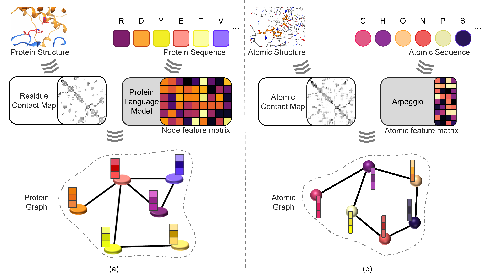

# MultiDDG
MultiDDG MultiDDG: A Multimodal Model Based on Protein Language Model for Predicting the Effects of Mutations on Protein-Protein Binding Affinity

## Overview
MultiDDG integrates residue features, protein structural features, and atomic-level features generated by a pre-trained protein language model, and achieves efficient and accurate prediction of ΔΔG through multimodal feature extraction. Evaluation results on multiple benchmark datasets show that the prediction performance of MultiDDG outperforms existing methods. In particular, MultiDDG demonstrates excellent performance in the classification prediction of favorable and unfavorable mutations. The model provides researchers with a powerful and flexible tool that contributes to a deeper understanding of protein-protein interactions and related disease mechanisms.

<p align="center">

</p>

## Installation

This source code is tested with `Python 3.8`. 

### Step 1: Clone the GitHub repository
```bash
git clone https://github.com/fengyufeng1/MultiDDG.git
cd MultiDDG
```

### Step 2: Build the required dependencies
#### conda
Building the required dependencies requires runing the script:
```bash
pip install -r requirements.txt
```
#### dokcer
```bash
docker pull fengyufeng1/multiddg
```
The above script will complete the following two things:  building a virtual enviroment named "affinity".

### Step 3: Download FoldX, HBPLUS, Naccess, Arpeggio, premodel

1. FoldX: The FoldX Suite is available through academic and commercial licenses. Please apply for a license and download FoldX v5.0 binary file from: http://foldxsuite.crg.eu/

2. Naccess: A residue accessibility (.rsa) file. http://www.bioinf.manchester.ac.uk/naccess/

3. Arpeggio: Arpeggio calculates interatomic contacts based on the rules defined in CREDO. https://github.com/harryjubb/arpeggio

4. Premodel: SeqVec, Rostlab/prot_bert_bfd, Rostlab/prot_t5_xl_uniref50, facebook/esm2_t33_650M_UR50D. https://huggingface.co/

## Project details

<table class="MsoTableGrid" border="1" cellspacing="0" cellpadding="0" style="border-collapse:collapse;border:none;mso-border-alt:solid windowtext .5pt;
 mso-yfti-tbllook:1184;mso-padding-alt:0cm 5.4pt 0cm 5.4pt">
 <tbody><tr style="mso-yfti-irow:0;mso-yfti-firstrow:yes">
  <td width="182" style="width:136.35pt;border:solid windowtext 1.0pt;mso-border-alt:
  solid windowtext .5pt;padding:0cm 5.4pt 0cm 5.4pt">
  <p class="MsoNormal" align="left" style="text-align:left"><b><span lang="EN-US" style="font-size:12.0pt;mso-bidi-font-size:14.0pt;font-family:&quot;Times New Roman&quot;,serif">Datasets<o:p></o:p></span></b></p>
  </td>
  <td width="169" style="width:126.6pt;border:solid windowtext 1.0pt;border-left:
  none;mso-border-left-alt:solid windowtext .5pt;mso-border-alt:solid windowtext .5pt;
  padding:0cm 5.4pt 0cm 5.4pt">
  <p class="MsoNormal" align="left" style="text-align:left"><span class="SpellE"><b><span lang="EN-US" style="font-size:12.0pt;mso-bidi-font-size:14.0pt;font-family:
  &quot;Times New Roman&quot;,serif">Feature_Path</span></b></span><b><span lang="EN-US" style="font-size:12.0pt;mso-bidi-font-size:14.0pt;font-family:&quot;Times New Roman&quot;,serif"><o:p></o:p></span></b></p>
  </td>
  <td width="150" style="width:112.4pt;border:solid windowtext 1.0pt;border-left:
  none;mso-border-left-alt:solid windowtext .5pt;mso-border-alt:solid windowtext .5pt;
  padding:0cm 5.4pt 0cm 5.4pt">
  <p class="MsoNormal" align="left" style="text-align:left"><span class="SpellE"><b><span lang="EN-US" style="font-size:12.0pt;mso-bidi-font-size:14.0pt;font-family:
  &quot;Times New Roman&quot;,serif">Preload_file</span></b></span><b><span lang="EN-US" style="font-size:12.0pt;mso-bidi-font-size:14.0pt;font-family:&quot;Times New Roman&quot;,serif"><o:p></o:p></span></b></p>
  </td>
  <td width="267" style="width:200.25pt;border:solid windowtext 1.0pt;border-left:
  none;mso-border-left-alt:solid windowtext .5pt;mso-border-alt:solid windowtext .5pt;
  padding:0cm 5.4pt 0cm 5.4pt">
  <p class="MsoNormal" align="left" style="text-align:left"><span class="SpellE"><b><span lang="EN-US" style="font-size:12.0pt;mso-bidi-font-size:14.0pt;font-family:
  &quot;Times New Roman&quot;,serif">Model_Path</span></b></span><b><span lang="EN-US" style="font-size:12.0pt;mso-bidi-font-size:14.0pt;font-family:&quot;Times New Roman&quot;,serif"><o:p></o:p></span></b></p>
  </td>
 </tr>
 <tr style="mso-yfti-irow:1">
  <td width="767" colspan="4" style="width:575.6pt;border:solid windowtext 1.0pt;
  border-top:none;mso-border-top-alt:solid windowtext .5pt;mso-border-alt:solid windowtext .5pt;
  padding:0cm 5.4pt 0cm 5.4pt">
  <p class="MsoNormal" align="center" style="text-align:center"><b><span lang="EN-US" style="font-family:&quot;Times New Roman&quot;,serif">Mutation-Level
  Cross-Validation</span></b><span lang="EN-US" style="font-family:&quot;Times New Roman&quot;,serif"><o:p></o:p></span></p>
  </td>
 </tr>
 <tr style="mso-yfti-irow:2">
  <td width="182" style="width:136.35pt;border:solid windowtext 1.0pt;border-top:
  none;mso-border-top-alt:solid windowtext .5pt;mso-border-alt:solid windowtext .5pt;
  padding:0cm 5.4pt 0cm 5.4pt">
  <p class="MsoNormal"><span lang="EN-US" style="font-family:&quot;Times New Roman&quot;,serif">SKEMPI1_S1131.pkl
  SKEMPI2_S4169.pkl ABbind_S645.pkl<o:p></o:p></span></p>
  </td>
  <td width="169" style="width:126.6pt;border-top:none;border-left:none;
  border-bottom:solid windowtext 1.0pt;border-right:solid windowtext 1.0pt;
  mso-border-top-alt:solid windowtext .5pt;mso-border-left-alt:solid windowtext .5pt;
  mso-border-alt:solid windowtext .5pt;padding:0cm 5.4pt 0cm 5.4pt">
  <p class="MsoNormal"><span class="GramE"><span lang="EN-US" style="font-family:
  &quot;Times New Roman&quot;,serif">./</span></span><span lang="EN-US" style="font-family:
  &quot;Times New Roman&quot;,serif">Feature/</span><span lang="EN-US" style="font-size:
  11.0pt;font-family:&quot;Times New Roman&quot;,serif;mso-fareast-font-family:等线;
  color:black">Feature_S1131-S4169-S8338-S645</span><span lang="EN-US" style="font-family:&quot;Times New Roman&quot;,serif">/<o:p></o:p></span></p>
  </td>
  <td width="150" style="width:112.4pt;border-top:none;border-left:none;
  border-bottom:solid windowtext 1.0pt;border-right:solid windowtext 1.0pt;
  mso-border-top-alt:solid windowtext .5pt;mso-border-left-alt:solid windowtext .5pt;
  mso-border-alt:solid windowtext .5pt;padding:0cm 5.4pt 0cm 5.4pt">
  <p class="MsoNormal"><span lang="EN-US" style="font-family:&quot;Times New Roman&quot;,serif"><o:p>&nbsp;</o:p></span></p>
  </td>
  <td width="267" style="width:200.25pt;border-top:none;border-left:none;
  border-bottom:solid windowtext 1.0pt;border-right:solid windowtext 1.0pt;
  mso-border-top-alt:solid windowtext .5pt;mso-border-left-alt:solid windowtext .5pt;
  mso-border-alt:solid windowtext .5pt;padding:0cm 5.4pt 0cm 5.4pt">
  <p class="MsoNormal"><span lang="EN-US" style="font-family:&quot;Times New Roman&quot;,serif"><o:p>&nbsp;</o:p></span></p>
  </td>
 </tr>
 <tr style="mso-yfti-irow:3">
  <td width="182" style="width:136.35pt;border:solid windowtext 1.0pt;border-top:
  none;mso-border-top-alt:solid windowtext .5pt;mso-border-alt:solid windowtext .5pt;
  padding:0cm 5.4pt 0cm 5.4pt">
  <p class="MsoNormal"><span lang="EN-US" style="font-family:&quot;Times New Roman&quot;,serif">SKEMPI2_S8338.pkl<o:p></o:p></span></p>
  </td>
  <td width="169" style="width:126.6pt;border-top:none;border-left:none;
  border-bottom:solid windowtext 1.0pt;border-right:solid windowtext 1.0pt;
  mso-border-top-alt:solid windowtext .5pt;mso-border-left-alt:solid windowtext .5pt;
  mso-border-alt:solid windowtext .5pt;padding:0cm 5.4pt 0cm 5.4pt">
  <p class="MsoNormal"><span class="GramE"><span lang="EN-US" style="font-family:
  &quot;Times New Roman&quot;,serif">./</span></span><span lang="EN-US" style="font-family:
  &quot;Times New Roman&quot;,serif">Feature/</span><span lang="EN-US" style="font-size:
  11.0pt;font-family:&quot;Times New Roman&quot;,serif;mso-fareast-font-family:等线;
  color:black">Feature_S1131-S4169-S8338-S645</span><span lang="EN-US" style="font-family:&quot;Times New Roman&quot;,serif">/<o:p></o:p></span></p>
  </td>
  <td width="150" style="width:112.4pt;border-top:none;border-left:none;
  border-bottom:solid windowtext 1.0pt;border-right:solid windowtext 1.0pt;
  mso-border-top-alt:solid windowtext .5pt;mso-border-left-alt:solid windowtext .5pt;
  mso-border-alt:solid windowtext .5pt;padding:0cm 5.4pt 0cm 5.4pt">
  <p class="MsoNormal"><span lang="EN-US" style="font-family:&quot;Times New Roman&quot;,serif">--<span class="SpellE">use_preloaded_splits</span><o:p></o:p></span></p>
  </td>
  <td width="267" style="width:200.25pt;border-top:none;border-left:none;
  border-bottom:solid windowtext 1.0pt;border-right:solid windowtext 1.0pt;
  mso-border-top-alt:solid windowtext .5pt;mso-border-left-alt:solid windowtext .5pt;
  mso-border-alt:solid windowtext .5pt;padding:0cm 5.4pt 0cm 5.4pt">
  <p class="MsoNormal"><span lang="EN-US" style="font-family:&quot;Times New Roman&quot;,serif"><o:p>&nbsp;</o:p></span></p>
  </td>
 </tr>
 <tr style="mso-yfti-irow:4">
  <td width="182" style="width:136.35pt;border:solid windowtext 1.0pt;border-top:
  none;mso-border-top-alt:solid windowtext .5pt;mso-border-alt:solid windowtext .5pt;
  padding:0cm 5.4pt 0cm 5.4pt">
  <p class="MsoNormal"><span lang="EN-US" style="font-family:&quot;Times New Roman&quot;,serif">SKEMPI2_S4191.pkl<o:p></o:p></span></p>
  </td>
  <td width="169" style="width:126.6pt;border-top:none;border-left:none;
  border-bottom:solid windowtext 1.0pt;border-right:solid windowtext 1.0pt;
  mso-border-top-alt:solid windowtext .5pt;mso-border-left-alt:solid windowtext .5pt;
  mso-border-alt:solid windowtext .5pt;padding:0cm 5.4pt 0cm 5.4pt">
  <p class="MsoNormal"><span class="GramE"><span lang="EN-US" style="font-family:
  &quot;Times New Roman&quot;,serif">./</span></span><span lang="EN-US" style="font-family:
  &quot;Times New Roman&quot;,serif">Feature/Feature_S4191/<o:p></o:p></span></p>
  </td>
  <td width="150" style="width:112.4pt;border-top:none;border-left:none;
  border-bottom:solid windowtext 1.0pt;border-right:solid windowtext 1.0pt;
  mso-border-top-alt:solid windowtext .5pt;mso-border-left-alt:solid windowtext .5pt;
  mso-border-alt:solid windowtext .5pt;padding:0cm 5.4pt 0cm 5.4pt">
  <p class="MsoNormal"><span lang="EN-US" style="font-family:&quot;Times New Roman&quot;,serif">--<span class="SpellE">use_preloaded_splits</span><o:p></o:p></span></p>
  </td>
  <td width="267" style="width:200.25pt;border-top:none;border-left:none;
  border-bottom:solid windowtext 1.0pt;border-right:solid windowtext 1.0pt;
  mso-border-top-alt:solid windowtext .5pt;mso-border-left-alt:solid windowtext .5pt;
  mso-border-alt:solid windowtext .5pt;padding:0cm 5.4pt 0cm 5.4pt">
  <p class="MsoNormal"><span lang="EN-US" style="font-family:&quot;Times New Roman&quot;,serif"><o:p>&nbsp;</o:p></span></p>
  </td>
 </tr>
 <tr style="mso-yfti-irow:5">
  <td width="182" style="width:136.35pt;border:solid windowtext 1.0pt;border-top:
  none;mso-border-top-alt:solid windowtext .5pt;mso-border-alt:solid windowtext .5pt;
  padding:0cm 5.4pt 0cm 5.4pt">
  <p class="MsoNormal"><span lang="EN-US" style="font-family:&quot;Times New Roman&quot;,serif">SKEMPI2_M1707.pkl<o:p></o:p></span></p>
  </td>
  <td width="169" style="width:126.6pt;border-top:none;border-left:none;
  border-bottom:solid windowtext 1.0pt;border-right:solid windowtext 1.0pt;
  mso-border-top-alt:solid windowtext .5pt;mso-border-left-alt:solid windowtext .5pt;
  mso-border-alt:solid windowtext .5pt;padding:0cm 5.4pt 0cm 5.4pt">
  <p class="MsoNormal"><span class="GramE"><span lang="EN-US" style="font-family:
  &quot;Times New Roman&quot;,serif">./</span></span><span lang="EN-US" style="font-family:
  &quot;Times New Roman&quot;,serif">Feature/Feature_M1707/<o:p></o:p></span></p>
  </td>
  <td width="150" style="width:112.4pt;border-top:none;border-left:none;
  border-bottom:solid windowtext 1.0pt;border-right:solid windowtext 1.0pt;
  mso-border-top-alt:solid windowtext .5pt;mso-border-left-alt:solid windowtext .5pt;
  mso-border-alt:solid windowtext .5pt;padding:0cm 5.4pt 0cm 5.4pt">
  <p class="MsoNormal"><span lang="EN-US" style="font-family:&quot;Times New Roman&quot;,serif">--<span class="SpellE">use_preloaded_splits</span><o:p></o:p></span></p>
  </td>
  <td width="267" style="width:200.25pt;border-top:none;border-left:none;
  border-bottom:solid windowtext 1.0pt;border-right:solid windowtext 1.0pt;
  mso-border-top-alt:solid windowtext .5pt;mso-border-left-alt:solid windowtext .5pt;
  mso-border-alt:solid windowtext .5pt;padding:0cm 5.4pt 0cm 5.4pt">
  <p class="MsoNormal"><span lang="EN-US" style="font-family:&quot;Times New Roman&quot;,serif"><o:p>&nbsp;</o:p></span></p>
  </td>
 </tr>
 <tr style="mso-yfti-irow:6">
  <td width="767" colspan="4" style="width:575.6pt;border:solid windowtext 1.0pt;
  border-top:none;mso-border-top-alt:solid windowtext .5pt;mso-border-alt:solid windowtext .5pt;
  padding:0cm 5.4pt 0cm 5.4pt">
  <p class="MsoNormal" align="center" style="text-align:center"><b><span lang="EN-US" style="font-family:&quot;Times New Roman&quot;,serif;mso-fareast-font-family:
  等线;color:black">Protein-Level Cross-Validation</span></b><span lang="EN-US" style="font-family:&quot;Times New Roman&quot;,serif"><o:p></o:p></span></p>
  </td>
 </tr>
 <tr style="mso-yfti-irow:7">
  <td width="767" colspan="4" style="width:575.6pt;border:solid windowtext 1.0pt;
  border-top:none;mso-border-top-alt:solid windowtext .5pt;mso-border-alt:solid windowtext .5pt;
  padding:0cm 5.4pt 0cm 5.4pt">
  <p class="MsoNormal" align="center" style="text-align:center"><span lang="EN-US" style="font-family:&quot;Times New Roman&quot;,serif;mso-fareast-font-family:等线;
  color:black">The leave-one-structure-out cross-validation</span><span lang="EN-US" style="font-family:&quot;Times New Roman&quot;,serif"><o:p></o:p></span></p>
  </td>
 </tr>
 <tr style="mso-yfti-irow:8">
  <td width="182" style="width:136.35pt;border:solid windowtext 1.0pt;border-top:
  none;mso-border-top-alt:solid windowtext .5pt;mso-border-alt:solid windowtext .5pt;
  padding:0cm 5.4pt 0cm 5.4pt">
  <p class="MsoNormal"><span lang="EN-US" style="font-size:11.0pt;font-family:&quot;Times New Roman&quot;,serif;
  mso-fareast-font-family:等线;color:black">SKEMPI2_S4169.pkl, SKEMPI2_S8338.pkl</span><span lang="EN-US" style="font-family:&quot;Times New Roman&quot;,serif"><o:p></o:p></span></p>
  </td>
  <td width="169" style="width:126.6pt;border-top:none;border-left:none;
  border-bottom:solid windowtext 1.0pt;border-right:solid windowtext 1.0pt;
  mso-border-top-alt:solid windowtext .5pt;mso-border-left-alt:solid windowtext .5pt;
  mso-border-alt:solid windowtext .5pt;padding:0cm 5.4pt 0cm 5.4pt">
  <p class="MsoNormal"><span class="GramE"><span lang="EN-US" style="font-family:
  &quot;Times New Roman&quot;,serif">./</span></span><span lang="EN-US" style="font-family:
  &quot;Times New Roman&quot;,serif">Feature/</span><span lang="EN-US" style="font-size:
  11.0pt;font-family:&quot;Times New Roman&quot;,serif;mso-fareast-font-family:等线;
  color:black">Feature_S1131-S4169-S8338-S645</span><span lang="EN-US" style="font-family:&quot;Times New Roman&quot;,serif">/<o:p></o:p></span></p>
  </td>
  <td width="150" style="width:112.4pt;border-top:none;border-left:none;
  border-bottom:solid windowtext 1.0pt;border-right:solid windowtext 1.0pt;
  mso-border-top-alt:solid windowtext .5pt;mso-border-left-alt:solid windowtext .5pt;
  mso-border-alt:solid windowtext .5pt;padding:0cm 5.4pt 0cm 5.4pt">
  <p class="MsoNormal"><span lang="EN-US" style="font-family:&quot;Times New Roman&quot;,serif"><o:p>&nbsp;</o:p></span></p>
  </td>
  <td width="267" style="width:200.25pt;border-top:none;border-left:none;
  border-bottom:solid windowtext 1.0pt;border-right:solid windowtext 1.0pt;
  mso-border-top-alt:solid windowtext .5pt;mso-border-left-alt:solid windowtext .5pt;
  mso-border-alt:solid windowtext .5pt;padding:0cm 5.4pt 0cm 5.4pt">
  <p class="MsoNormal"><span lang="EN-US" style="font-family:&quot;Times New Roman&quot;,serif"><o:p>&nbsp;</o:p></span></p>
  </td>
 </tr>
 <tr style="mso-yfti-irow:9">
  <td width="182" style="width:136.35pt;border:solid windowtext 1.0pt;border-top:
  none;mso-border-top-alt:solid windowtext .5pt;mso-border-alt:solid windowtext .5pt;
  padding:0cm 5.4pt 0cm 5.4pt">
  <p class="MsoNormal"><span lang="EN-US" style="font-size:11.0pt;font-family:&quot;Times New Roman&quot;,serif;
  mso-fareast-font-family:等线;color:black">SKEMPI2_S4191.pkl</span><span lang="EN-US" style="font-family:&quot;Times New Roman&quot;,serif"><o:p></o:p></span></p>
  </td>
  <td width="169" style="width:126.6pt;border-top:none;border-left:none;
  border-bottom:solid windowtext 1.0pt;border-right:solid windowtext 1.0pt;
  mso-border-top-alt:solid windowtext .5pt;mso-border-left-alt:solid windowtext .5pt;
  mso-border-alt:solid windowtext .5pt;padding:0cm 5.4pt 0cm 5.4pt">
  <p class="MsoNormal"><span class="GramE"><span lang="EN-US" style="font-size:11.0pt;
  font-family:&quot;Times New Roman&quot;,serif;mso-fareast-font-family:等线;color:black">./</span></span><span lang="EN-US" style="font-size:11.0pt;font-family:&quot;Times New Roman&quot;,serif;
  mso-fareast-font-family:等线;color:black">Feature/Feature_S4191/</span><span lang="EN-US" style="font-family:&quot;Times New Roman&quot;,serif"><o:p></o:p></span></p>
  </td>
  <td width="150" style="width:112.4pt;border-top:none;border-left:none;
  border-bottom:solid windowtext 1.0pt;border-right:solid windowtext 1.0pt;
  mso-border-top-alt:solid windowtext .5pt;mso-border-left-alt:solid windowtext .5pt;
  mso-border-alt:solid windowtext .5pt;padding:0cm 5.4pt 0cm 5.4pt">
  <p class="MsoNormal"><span lang="EN-US" style="font-family:&quot;Times New Roman&quot;,serif"><o:p>&nbsp;</o:p></span></p>
  </td>
  <td width="267" style="width:200.25pt;border-top:none;border-left:none;
  border-bottom:solid windowtext 1.0pt;border-right:solid windowtext 1.0pt;
  mso-border-top-alt:solid windowtext .5pt;mso-border-left-alt:solid windowtext .5pt;
  mso-border-alt:solid windowtext .5pt;padding:0cm 5.4pt 0cm 5.4pt">
  <p class="MsoNormal"><span lang="EN-US" style="font-family:&quot;Times New Roman&quot;,serif"><o:p>&nbsp;</o:p></span></p>
  </td>
 </tr>
 <tr style="mso-yfti-irow:10">
  <td width="182" style="width:136.35pt;border:solid windowtext 1.0pt;border-top:
  none;mso-border-top-alt:solid windowtext .5pt;mso-border-alt:solid windowtext .5pt;
  padding:0cm 5.4pt 0cm 5.4pt">
  <p class="MsoNormal"><span lang="EN-US" style="font-size:11.0pt;font-family:&quot;Times New Roman&quot;,serif;
  mso-fareast-font-family:等线;color:black">SKEMPI2_M1707.pkl</span><span lang="EN-US" style="font-family:&quot;Times New Roman&quot;,serif"><o:p></o:p></span></p>
  </td>
  <td width="169" style="width:126.6pt;border-top:none;border-left:none;
  border-bottom:solid windowtext 1.0pt;border-right:solid windowtext 1.0pt;
  mso-border-top-alt:solid windowtext .5pt;mso-border-left-alt:solid windowtext .5pt;
  mso-border-alt:solid windowtext .5pt;padding:0cm 5.4pt 0cm 5.4pt">
  <p class="MsoNormal"><span class="GramE"><span lang="EN-US" style="font-size:11.0pt;
  font-family:&quot;Times New Roman&quot;,serif;mso-fareast-font-family:等线;color:black">./</span></span><span lang="EN-US" style="font-size:11.0pt;font-family:&quot;Times New Roman&quot;,serif;
  mso-fareast-font-family:等线;color:black">Feature/Feature_M1707/</span><span lang="EN-US" style="font-family:&quot;Times New Roman&quot;,serif"><o:p></o:p></span></p>
  </td>
  <td width="150" style="width:112.4pt;border-top:none;border-left:none;
  border-bottom:solid windowtext 1.0pt;border-right:solid windowtext 1.0pt;
  mso-border-top-alt:solid windowtext .5pt;mso-border-left-alt:solid windowtext .5pt;
  mso-border-alt:solid windowtext .5pt;padding:0cm 5.4pt 0cm 5.4pt">
  <p class="MsoNormal"><span lang="EN-US" style="font-family:&quot;Times New Roman&quot;,serif"><o:p>&nbsp;</o:p></span></p>
  </td>
  <td width="267" style="width:200.25pt;border-top:none;border-left:none;
  border-bottom:solid windowtext 1.0pt;border-right:solid windowtext 1.0pt;
  mso-border-top-alt:solid windowtext .5pt;mso-border-left-alt:solid windowtext .5pt;
  mso-border-alt:solid windowtext .5pt;padding:0cm 5.4pt 0cm 5.4pt">
  <p class="MsoNormal"><span lang="EN-US" style="font-family:&quot;Times New Roman&quot;,serif"><o:p>&nbsp;</o:p></span></p>
  </td>
 </tr>
 <tr style="mso-yfti-irow:11">
  <td width="767" colspan="4" style="width:575.6pt;border:solid windowtext 1.0pt;
  border-top:none;mso-border-top-alt:solid windowtext .5pt;mso-border-alt:solid windowtext .5pt;
  padding:0cm 5.4pt 0cm 5.4pt">
  <p class="MsoNormal" align="center" style="text-align:center"><span lang="EN-US" style="font-family:&quot;Times New Roman&quot;,serif;mso-fareast-font-family:等线;
  color:black">The split-by-structure cross-validation</span><span lang="EN-US" style="font-family:&quot;Times New Roman&quot;,serif"><o:p></o:p></span></p>
  </td>
 </tr>
 <tr style="mso-yfti-irow:12">
  <td width="182" style="width:136.35pt;border:solid windowtext 1.0pt;border-top:
  none;mso-border-top-alt:solid windowtext .5pt;mso-border-alt:solid windowtext .5pt;
  padding:0cm 5.4pt 0cm 5.4pt">
  <p class="MsoNormal"><span lang="EN-US" style="font-size:11.0pt;font-family:&quot;Times New Roman&quot;,serif;
  mso-fareast-font-family:等线;color:black">SKEMPI1_S1131.pkl SKEMPI2_S4169.pkl
  ABbind_S645.pkl SKEMPI2_S8338.pkl"</span><span lang="EN-US" style="font-family:&quot;Times New Roman&quot;,serif"><o:p></o:p></span></p>
  </td>
  <td width="169" style="width:126.6pt;border-top:none;border-left:none;
  border-bottom:solid windowtext 1.0pt;border-right:solid windowtext 1.0pt;
  mso-border-top-alt:solid windowtext .5pt;mso-border-left-alt:solid windowtext .5pt;
  mso-border-alt:solid windowtext .5pt;padding:0cm 5.4pt 0cm 5.4pt">
  <p class="MsoNormal"><span class="GramE"><span lang="EN-US" style="font-family:
  &quot;Times New Roman&quot;,serif">./</span></span><span lang="EN-US" style="font-family:
  &quot;Times New Roman&quot;,serif">Feature/</span><span lang="EN-US" style="font-size:
  11.0pt;font-family:&quot;Times New Roman&quot;,serif;mso-fareast-font-family:等线;
  color:black">Feature_S1131-S4169-S8338-S645</span><span lang="EN-US" style="font-family:&quot;Times New Roman&quot;,serif">/<o:p></o:p></span></p>
  </td>
  <td width="150" style="width:112.4pt;border-top:none;border-left:none;
  border-bottom:solid windowtext 1.0pt;border-right:solid windowtext 1.0pt;
  mso-border-top-alt:solid windowtext .5pt;mso-border-left-alt:solid windowtext .5pt;
  mso-border-alt:solid windowtext .5pt;padding:0cm 5.4pt 0cm 5.4pt">
  <p class="MsoNormal"><span lang="EN-US" style="font-family:&quot;Times New Roman&quot;,serif"><o:p>&nbsp;</o:p></span></p>
  </td>
  <td width="267" style="width:200.25pt;border-top:none;border-left:none;
  border-bottom:solid windowtext 1.0pt;border-right:solid windowtext 1.0pt;
  mso-border-top-alt:solid windowtext .5pt;mso-border-left-alt:solid windowtext .5pt;
  mso-border-alt:solid windowtext .5pt;padding:0cm 5.4pt 0cm 5.4pt">
  <p class="MsoNormal"><span lang="EN-US" style="font-family:&quot;Times New Roman&quot;,serif"><o:p>&nbsp;</o:p></span></p>
  </td>
 </tr>
 <tr style="mso-yfti-irow:13">
  <td width="767" colspan="4" style="width:575.6pt;border:solid windowtext 1.0pt;
  border-top:none;mso-border-top-alt:solid windowtext .5pt;mso-border-alt:solid windowtext .5pt;
  padding:0cm 5.4pt 0cm 5.4pt">
  <p class="MsoNormal" align="center" style="text-align:center;mso-pagination:widow-orphan"><b><span lang="EN-US" style="font-family:&quot;Times New Roman&quot;,serif;mso-fareast-font-family:
  等线;color:black">Train on S4191, test on S487, S33<o:p></o:p></span></b></p>
  </td>
 </tr>
 <tr style="mso-yfti-irow:14">
  <td width="182" style="width:136.35pt;border:solid windowtext 1.0pt;border-top:
  none;mso-border-top-alt:solid windowtext .5pt;mso-border-alt:solid windowtext .5pt;
  padding:0cm 5.4pt 0cm 5.4pt">
  <p class="MsoNormal"><span lang="EN-US" style="font-size:11.0pt;font-family:&quot;Times New Roman&quot;,serif;
  mso-fareast-font-family:等线;color:black">SKEMPI2_S4191_train.pkl</span><span lang="EN-US" style="font-family:&quot;Times New Roman&quot;,serif"><o:p></o:p></span></p>
  </td>
  <td width="169" style="width:126.6pt;border-top:none;border-left:none;
  border-bottom:solid windowtext 1.0pt;border-right:solid windowtext 1.0pt;
  mso-border-top-alt:solid windowtext .5pt;mso-border-left-alt:solid windowtext .5pt;
  mso-border-alt:solid windowtext .5pt;padding:0cm 5.4pt 0cm 5.4pt">
  <p class="MsoNormal"><span class="GramE"><span lang="EN-US" style="font-size:11.0pt;
  font-family:&quot;Times New Roman&quot;,serif;mso-fareast-font-family:等线;color:black">./</span></span><span lang="EN-US" style="font-size:11.0pt;font-family:&quot;Times New Roman&quot;,serif;
  mso-fareast-font-family:等线;color:black">Feature/Feature_S4191/</span><span lang="EN-US" style="font-family:&quot;Times New Roman&quot;,serif"><o:p></o:p></span></p>
  </td>
  <td width="150" style="width:112.4pt;border-top:none;border-left:none;
  border-bottom:solid windowtext 1.0pt;border-right:solid windowtext 1.0pt;
  mso-border-top-alt:solid windowtext .5pt;mso-border-left-alt:solid windowtext .5pt;
  mso-border-alt:solid windowtext .5pt;padding:0cm 5.4pt 0cm 5.4pt">
  <p class="MsoNormal"><span lang="EN-US" style="font-family:&quot;Times New Roman&quot;,serif"><o:p>&nbsp;</o:p></span></p>
  </td>
  <td width="267" style="width:200.25pt;border-top:none;border-left:none;
  border-bottom:solid windowtext 1.0pt;border-right:solid windowtext 1.0pt;
  mso-border-top-alt:solid windowtext .5pt;mso-border-left-alt:solid windowtext .5pt;
  mso-border-alt:solid windowtext .5pt;padding:0cm 5.4pt 0cm 5.4pt">
  <p class="MsoNormal"><span class="GramE"><span lang="EN-US" style="font-size:11.0pt;
  font-family:&quot;Times New Roman&quot;,serif;mso-fareast-font-family:等线;color:black">./</span></span><span class="SpellE"><span lang="EN-US" style="font-size:11.0pt;font-family:&quot;Times New Roman&quot;,serif;
  mso-fareast-font-family:等线;color:black">Blind_test</span></span><span lang="EN-US" style="font-size:11.0pt;font-family:&quot;Times New Roman&quot;,serif;
  mso-fareast-font-family:等线;color:black">/<span class="SpellE">Train_Model</span>/S4191_Model/</span><span lang="EN-US" style="font-family:&quot;Times New Roman&quot;,serif"><o:p></o:p></span></p>
  </td>
 </tr>
 <tr style="mso-yfti-irow:15">
  <td width="182" style="width:136.35pt;border:solid windowtext 1.0pt;border-top:
  none;mso-border-top-alt:solid windowtext .5pt;mso-border-alt:solid windowtext .5pt;
  padding:0cm 5.4pt 0cm 5.4pt">
  <p class="MsoNormal"><span lang="EN-US" style="font-size:11.0pt;font-family:&quot;Times New Roman&quot;,serif;
  mso-fareast-font-family:等线;color:black">SKEMPI2_S487_test.pkl</span><span lang="EN-US" style="font-family:&quot;Times New Roman&quot;,serif"><o:p></o:p></span></p>
  </td>
  <td width="169" style="width:126.6pt;border-top:none;border-left:none;
  border-bottom:solid windowtext 1.0pt;border-right:solid windowtext 1.0pt;
  mso-border-top-alt:solid windowtext .5pt;mso-border-left-alt:solid windowtext .5pt;
  mso-border-alt:solid windowtext .5pt;padding:0cm 5.4pt 0cm 5.4pt">
  <p class="MsoNormal"><span class="GramE"><span lang="EN-US" style="font-size:11.0pt;
  font-family:&quot;Times New Roman&quot;,serif;mso-fareast-font-family:等线;color:black">./</span></span><span lang="EN-US" style="font-size:11.0pt;font-family:&quot;Times New Roman&quot;,serif;
  mso-fareast-font-family:等线;color:black">Feature/Feature_S4191/</span><span lang="EN-US" style="font-family:&quot;Times New Roman&quot;,serif"><o:p></o:p></span></p>
  </td>
  <td width="150" style="width:112.4pt;border-top:none;border-left:none;
  border-bottom:solid windowtext 1.0pt;border-right:solid windowtext 1.0pt;
  mso-border-top-alt:solid windowtext .5pt;mso-border-left-alt:solid windowtext .5pt;
  mso-border-alt:solid windowtext .5pt;padding:0cm 5.4pt 0cm 5.4pt">
  <p class="MsoNormal"><span lang="EN-US" style="font-family:&quot;Times New Roman&quot;,serif"><o:p>&nbsp;</o:p></span></p>
  </td>
  <td width="267" style="width:200.25pt;border-top:none;border-left:none;
  border-bottom:solid windowtext 1.0pt;border-right:solid windowtext 1.0pt;
  mso-border-top-alt:solid windowtext .5pt;mso-border-left-alt:solid windowtext .5pt;
  mso-border-alt:solid windowtext .5pt;padding:0cm 5.4pt 0cm 5.4pt">
  <p class="MsoNormal"><span class="GramE"><span lang="EN-US" style="font-size:11.0pt;
  font-family:&quot;Times New Roman&quot;,serif;mso-fareast-font-family:等线;color:black">./</span></span><span class="SpellE"><span lang="EN-US" style="font-size:11.0pt;font-family:&quot;Times New Roman&quot;,serif;
  mso-fareast-font-family:等线;color:black">Blind_test</span></span><span lang="EN-US" style="font-size:11.0pt;font-family:&quot;Times New Roman&quot;,serif;
  mso-fareast-font-family:等线;color:black">/<span class="SpellE">Train_Model</span>/S4191_Model/</span><span lang="EN-US" style="font-family:&quot;Times New Roman&quot;,serif"><o:p></o:p></span></p>
  </td>
 </tr>
 <tr style="mso-yfti-irow:16">
  <td width="182" style="width:136.35pt;border:solid windowtext 1.0pt;border-top:
  none;mso-border-top-alt:solid windowtext .5pt;mso-border-alt:solid windowtext .5pt;
  padding:0cm 5.4pt 0cm 5.4pt">
  <p class="MsoNormal"><span lang="EN-US" style="font-size:11.0pt;font-family:&quot;Times New Roman&quot;,serif;
  mso-fareast-font-family:等线;color:black">Test_S33.pkl</span><span lang="EN-US" style="font-family:&quot;Times New Roman&quot;,serif"><o:p></o:p></span></p>
  </td>
  <td width="169" style="width:126.6pt;border-top:none;border-left:none;
  border-bottom:solid windowtext 1.0pt;border-right:solid windowtext 1.0pt;
  mso-border-top-alt:solid windowtext .5pt;mso-border-left-alt:solid windowtext .5pt;
  mso-border-alt:solid windowtext .5pt;padding:0cm 5.4pt 0cm 5.4pt">
  <p class="MsoNormal"><span class="GramE"><span lang="EN-US" style="font-size:11.0pt;
  font-family:&quot;Times New Roman&quot;,serif;mso-fareast-font-family:等线;color:black">./</span></span><span lang="EN-US" style="font-size:11.0pt;font-family:&quot;Times New Roman&quot;,serif;
  mso-fareast-font-family:等线;color:black">Feature/Feature_S33/</span><span lang="EN-US" style="font-family:&quot;Times New Roman&quot;,serif"><o:p></o:p></span></p>
  </td>
  <td width="150" style="width:112.4pt;border-top:none;border-left:none;
  border-bottom:solid windowtext 1.0pt;border-right:solid windowtext 1.0pt;
  mso-border-top-alt:solid windowtext .5pt;mso-border-left-alt:solid windowtext .5pt;
  mso-border-alt:solid windowtext .5pt;padding:0cm 5.4pt 0cm 5.4pt">
  <p class="MsoNormal"><span lang="EN-US" style="font-family:&quot;Times New Roman&quot;,serif"><o:p>&nbsp;</o:p></span></p>
  </td>
  <td width="267" style="width:200.25pt;border-top:none;border-left:none;
  border-bottom:solid windowtext 1.0pt;border-right:solid windowtext 1.0pt;
  mso-border-top-alt:solid windowtext .5pt;mso-border-left-alt:solid windowtext .5pt;
  mso-border-alt:solid windowtext .5pt;padding:0cm 5.4pt 0cm 5.4pt">
  <p class="MsoNormal"><span class="GramE"><span lang="EN-US" style="font-size:11.0pt;
  font-family:&quot;Times New Roman&quot;,serif;mso-fareast-font-family:等线;color:black">./</span></span><span class="SpellE"><span lang="EN-US" style="font-size:11.0pt;font-family:&quot;Times New Roman&quot;,serif;
  mso-fareast-font-family:等线;color:black">Blind_test</span></span><span lang="EN-US" style="font-size:11.0pt;font-family:&quot;Times New Roman&quot;,serif;
  mso-fareast-font-family:等线;color:black">/<span class="SpellE">Train_Model</span>/S4191_Model/</span><span lang="EN-US" style="font-family:&quot;Times New Roman&quot;,serif"><o:p></o:p></span></p>
  </td>
 </tr>
 <tr style="mso-yfti-irow:17">
  <td width="767" colspan="4" style="width:575.6pt;border:solid windowtext 1.0pt;
  border-top:none;mso-border-top-alt:solid windowtext .5pt;mso-border-alt:solid windowtext .5pt;
  padding:0cm 5.4pt 0cm 5.4pt">
  <p class="MsoNormal" align="center" style="text-align:center"><b><span lang="EN-US" style="font-family:&quot;Times New Roman&quot;,serif;mso-fareast-font-family:
  等线;color:black">Train on M1340, test on M595, S285</span></b><span lang="EN-US" style="font-family:&quot;Times New Roman&quot;,serif"><o:p></o:p></span></p>
  </td>
 </tr>
 <tr style="mso-yfti-irow:18">
  <td width="182" style="width:136.35pt;border:solid windowtext 1.0pt;border-top:
  none;mso-border-top-alt:solid windowtext .5pt;mso-border-alt:solid windowtext .5pt;
  padding:0cm 5.4pt 0cm 5.4pt">
  <p class="MsoNormal"><span lang="EN-US" style="font-size:11.0pt;font-family:&quot;Times New Roman&quot;,serif;
  mso-fareast-font-family:等线;color:black">SKEMPI2_M1340_train.pkl</span><span lang="EN-US" style="font-family:&quot;Times New Roman&quot;,serif"><o:p></o:p></span></p>
  </td>
  <td width="169" style="width:126.6pt;border-top:none;border-left:none;
  border-bottom:solid windowtext 1.0pt;border-right:solid windowtext 1.0pt;
  mso-border-top-alt:solid windowtext .5pt;mso-border-left-alt:solid windowtext .5pt;
  mso-border-alt:solid windowtext .5pt;padding:0cm 5.4pt 0cm 5.4pt">
  <p class="MsoNormal"><span class="GramE"><span lang="EN-US" style="font-size:11.0pt;
  font-family:&quot;Times New Roman&quot;,serif;mso-fareast-font-family:等线;color:black">./</span></span><span lang="EN-US" style="font-size:11.0pt;font-family:&quot;Times New Roman&quot;,serif;
  mso-fareast-font-family:等线;color:black">Feature/Feature_M1340-M595/</span><span lang="EN-US" style="font-family:&quot;Times New Roman&quot;,serif"><o:p></o:p></span></p>
  </td>
  <td width="150" style="width:112.4pt;border-top:none;border-left:none;
  border-bottom:solid windowtext 1.0pt;border-right:solid windowtext 1.0pt;
  mso-border-top-alt:solid windowtext .5pt;mso-border-left-alt:solid windowtext .5pt;
  mso-border-alt:solid windowtext .5pt;padding:0cm 5.4pt 0cm 5.4pt">
  <p class="MsoNormal"><span lang="EN-US" style="font-family:&quot;Times New Roman&quot;,serif"><o:p>&nbsp;</o:p></span></p>
  </td>
  <td width="267" style="width:200.25pt;border-top:none;border-left:none;
  border-bottom:solid windowtext 1.0pt;border-right:solid windowtext 1.0pt;
  mso-border-top-alt:solid windowtext .5pt;mso-border-left-alt:solid windowtext .5pt;
  mso-border-alt:solid windowtext .5pt;padding:0cm 5.4pt 0cm 5.4pt">
  <p class="MsoNormal"><span class="GramE"><span lang="EN-US" style="font-size:11.0pt;
  font-family:&quot;Times New Roman&quot;,serif;mso-fareast-font-family:等线;color:black">./</span></span><span class="SpellE"><span lang="EN-US" style="font-size:11.0pt;font-family:&quot;Times New Roman&quot;,serif;
  mso-fareast-font-family:等线;color:black">Blind_test</span></span><span lang="EN-US" style="font-size:11.0pt;font-family:&quot;Times New Roman&quot;,serif;
  mso-fareast-font-family:等线;color:black">/<span class="SpellE">Train_Model</span>/M1340_Model/</span><span lang="EN-US" style="font-family:&quot;Times New Roman&quot;,serif"><o:p></o:p></span></p>
  </td>
 </tr>
 <tr style="mso-yfti-irow:19">
  <td width="182" style="width:136.35pt;border:solid windowtext 1.0pt;border-top:
  none;mso-border-top-alt:solid windowtext .5pt;mso-border-alt:solid windowtext .5pt;
  padding:0cm 5.4pt 0cm 5.4pt">
  <p class="MsoNormal"><span lang="EN-US" style="font-size:11.0pt;font-family:&quot;Times New Roman&quot;,serif;
  mso-fareast-font-family:等线;color:black">SKEMPI2_M595_test.pkl</span><span lang="EN-US" style="font-family:&quot;Times New Roman&quot;,serif"><o:p></o:p></span></p>
  </td>
  <td width="169" style="width:126.6pt;border-top:none;border-left:none;
  border-bottom:solid windowtext 1.0pt;border-right:solid windowtext 1.0pt;
  mso-border-top-alt:solid windowtext .5pt;mso-border-left-alt:solid windowtext .5pt;
  mso-border-alt:solid windowtext .5pt;padding:0cm 5.4pt 0cm 5.4pt">
  <p class="MsoNormal"><span class="GramE"><span lang="EN-US" style="font-size:11.0pt;
  font-family:&quot;Times New Roman&quot;,serif;mso-fareast-font-family:等线;color:black">./</span></span><span lang="EN-US" style="font-size:11.0pt;font-family:&quot;Times New Roman&quot;,serif;
  mso-fareast-font-family:等线;color:black">Feature/Feature_M1340-M595/</span><span lang="EN-US" style="font-family:&quot;Times New Roman&quot;,serif"><o:p></o:p></span></p>
  </td>
  <td width="150" style="width:112.4pt;border-top:none;border-left:none;
  border-bottom:solid windowtext 1.0pt;border-right:solid windowtext 1.0pt;
  mso-border-top-alt:solid windowtext .5pt;mso-border-left-alt:solid windowtext .5pt;
  mso-border-alt:solid windowtext .5pt;padding:0cm 5.4pt 0cm 5.4pt">
  <p class="MsoNormal"><span lang="EN-US" style="font-family:&quot;Times New Roman&quot;,serif"><o:p>&nbsp;</o:p></span></p>
  </td>
  <td width="267" style="width:200.25pt;border-top:none;border-left:none;
  border-bottom:solid windowtext 1.0pt;border-right:solid windowtext 1.0pt;
  mso-border-top-alt:solid windowtext .5pt;mso-border-left-alt:solid windowtext .5pt;
  mso-border-alt:solid windowtext .5pt;padding:0cm 5.4pt 0cm 5.4pt">
  <p class="MsoNormal"><span class="GramE"><span lang="EN-US" style="font-size:11.0pt;
  font-family:&quot;Times New Roman&quot;,serif;mso-fareast-font-family:等线;color:black">./</span></span><span class="SpellE"><span lang="EN-US" style="font-size:11.0pt;font-family:&quot;Times New Roman&quot;,serif;
  mso-fareast-font-family:等线;color:black">Blind_test</span></span><span lang="EN-US" style="font-size:11.0pt;font-family:&quot;Times New Roman&quot;,serif;
  mso-fareast-font-family:等线;color:black">/<span class="SpellE">Train_Model</span>/M1340_Model/</span><span lang="EN-US" style="font-family:&quot;Times New Roman&quot;,serif"><o:p></o:p></span></p>
  </td>
 </tr>
 <tr style="mso-yfti-irow:20">
  <td width="182" style="width:136.35pt;border:solid windowtext 1.0pt;border-top:
  none;mso-border-top-alt:solid windowtext .5pt;mso-border-alt:solid windowtext .5pt;
  padding:0cm 5.4pt 0cm 5.4pt">
  <p class="MsoNormal"><span lang="EN-US" style="font-size:11.0pt;font-family:&quot;Times New Roman&quot;,serif;
  mso-fareast-font-family:等线;color:black">SARS_S285_test.pkl</span><span lang="EN-US" style="font-family:&quot;Times New Roman&quot;,serif"><o:p></o:p></span></p>
  </td>
  <td width="169" style="width:126.6pt;border-top:none;border-left:none;
  border-bottom:solid windowtext 1.0pt;border-right:solid windowtext 1.0pt;
  mso-border-top-alt:solid windowtext .5pt;mso-border-left-alt:solid windowtext .5pt;
  mso-border-alt:solid windowtext .5pt;padding:0cm 5.4pt 0cm 5.4pt">
  <p class="MsoNormal"><span class="GramE"><span lang="EN-US" style="font-size:11.0pt;
  font-family:&quot;Times New Roman&quot;,serif;mso-fareast-font-family:等线;color:black">./</span></span><span lang="EN-US" style="font-size:11.0pt;font-family:&quot;Times New Roman&quot;,serif;
  mso-fareast-font-family:等线;color:black">Feature/Feature_S285/</span><span lang="EN-US" style="font-family:&quot;Times New Roman&quot;,serif"><o:p></o:p></span></p>
  </td>
  <td width="150" style="width:112.4pt;border-top:none;border-left:none;
  border-bottom:solid windowtext 1.0pt;border-right:solid windowtext 1.0pt;
  mso-border-top-alt:solid windowtext .5pt;mso-border-left-alt:solid windowtext .5pt;
  mso-border-alt:solid windowtext .5pt;padding:0cm 5.4pt 0cm 5.4pt">
  <p class="MsoNormal"><span lang="EN-US" style="font-family:&quot;Times New Roman&quot;,serif"><o:p>&nbsp;</o:p></span></p>
  </td>
  <td width="267" style="width:200.25pt;border-top:none;border-left:none;
  border-bottom:solid windowtext 1.0pt;border-right:solid windowtext 1.0pt;
  mso-border-top-alt:solid windowtext .5pt;mso-border-left-alt:solid windowtext .5pt;
  mso-border-alt:solid windowtext .5pt;padding:0cm 5.4pt 0cm 5.4pt">
  <p class="MsoNormal"><span class="GramE"><span lang="EN-US" style="font-size:11.0pt;
  font-family:&quot;Times New Roman&quot;,serif;mso-fareast-font-family:等线;color:black">./</span></span><span class="SpellE"><span lang="EN-US" style="font-size:11.0pt;font-family:&quot;Times New Roman&quot;,serif;
  mso-fareast-font-family:等线;color:black">Blind_test</span></span><span lang="EN-US" style="font-size:11.0pt;font-family:&quot;Times New Roman&quot;,serif;
  mso-fareast-font-family:等线;color:black">/<span class="SpellE">Train_Model</span>/M1340_Model/</span><span lang="EN-US" style="font-family:&quot;Times New Roman&quot;,serif"><o:p></o:p></span></p>
  </td>
 </tr>
 <tr style="mso-yfti-irow:21">
  <td width="767" colspan="4" style="width:575.6pt;border:solid windowtext 1.0pt;
  border-top:none;mso-border-top-alt:solid windowtext .5pt;mso-border-alt:solid windowtext .5pt;
  padding:0cm 5.4pt 0cm 5.4pt">
  <p class="MsoNormal" align="center" style="text-align:center;mso-pagination:widow-orphan"><b><span lang="EN-US" style="font-family:&quot;Times New Roman&quot;,serif;mso-fareast-font-family:
  等线;color:black">Train on 2M1470, test on 2M888, T55, T56<o:p></o:p></span></b></p>
  </td>
 </tr>
 <tr style="mso-yfti-irow:22">
  <td width="182" style="width:136.35pt;border:solid windowtext 1.0pt;border-top:
  none;mso-border-top-alt:solid windowtext .5pt;mso-border-alt:solid windowtext .5pt;
  padding:0cm 5.4pt 0cm 5.4pt">
  <p class="MsoNormal"><span lang="EN-US" style="font-size:11.0pt;font-family:&quot;Times New Roman&quot;,serif;
  mso-fareast-font-family:等线;color:black">Train_2M1470.pkl</span><span lang="EN-US" style="font-family:&quot;Times New Roman&quot;,serif"><o:p></o:p></span></p>
  </td>
  <td width="169" style="width:126.6pt;border-top:none;border-left:none;
  border-bottom:solid windowtext 1.0pt;border-right:solid windowtext 1.0pt;
  mso-border-top-alt:solid windowtext .5pt;mso-border-left-alt:solid windowtext .5pt;
  mso-border-alt:solid windowtext .5pt;padding:0cm 5.4pt 0cm 5.4pt">
  <p class="MsoNormal"><span class="GramE"><span lang="EN-US" style="font-size:11.0pt;
  font-family:&quot;Times New Roman&quot;,serif;mso-fareast-font-family:等线;color:black">./</span></span><span lang="EN-US" style="font-size:11.0pt;font-family:&quot;Times New Roman&quot;,serif;
  mso-fareast-font-family:等线;color:black">Feature/Feature_2M/</span><span lang="EN-US" style="font-family:&quot;Times New Roman&quot;,serif"><o:p></o:p></span></p>
  </td>
  <td width="150" style="width:112.4pt;border-top:none;border-left:none;
  border-bottom:solid windowtext 1.0pt;border-right:solid windowtext 1.0pt;
  mso-border-top-alt:solid windowtext .5pt;mso-border-left-alt:solid windowtext .5pt;
  mso-border-alt:solid windowtext .5pt;padding:0cm 5.4pt 0cm 5.4pt">
  <p class="MsoNormal"><span lang="EN-US" style="font-family:&quot;Times New Roman&quot;,serif"><o:p>&nbsp;</o:p></span></p>
  </td>
  <td width="267" style="width:200.25pt;border-top:none;border-left:none;
  border-bottom:solid windowtext 1.0pt;border-right:solid windowtext 1.0pt;
  mso-border-top-alt:solid windowtext .5pt;mso-border-left-alt:solid windowtext .5pt;
  mso-border-alt:solid windowtext .5pt;padding:0cm 5.4pt 0cm 5.4pt">
  <p class="MsoNormal"><span class="GramE"><span lang="EN-US" style="font-size:11.0pt;
  font-family:&quot;Times New Roman&quot;,serif;mso-fareast-font-family:等线;color:black">./</span></span><span class="SpellE"><span lang="EN-US" style="font-size:11.0pt;font-family:&quot;Times New Roman&quot;,serif;
  mso-fareast-font-family:等线;color:black">Blind_test</span></span><span lang="EN-US" style="font-size:11.0pt;font-family:&quot;Times New Roman&quot;,serif;
  mso-fareast-font-family:等线;color:black">/<span class="SpellE">Train_Model</span>/2M1470_Model/</span><span lang="EN-US" style="font-family:&quot;Times New Roman&quot;,serif"><o:p></o:p></span></p>
  </td>
 </tr>
 <tr style="mso-yfti-irow:23">
  <td width="182" style="width:136.35pt;border:solid windowtext 1.0pt;border-top:
  none;mso-border-top-alt:solid windowtext .5pt;mso-border-alt:solid windowtext .5pt;
  padding:0cm 5.4pt 0cm 5.4pt">
  <p class="MsoNormal"><span lang="EN-US" style="font-size:11.0pt;font-family:&quot;Times New Roman&quot;,serif;
  mso-fareast-font-family:等线;color:black">Test_2M888.pkl</span><span lang="EN-US" style="font-family:&quot;Times New Roman&quot;,serif"><o:p></o:p></span></p>
  </td>
  <td width="169" style="width:126.6pt;border-top:none;border-left:none;
  border-bottom:solid windowtext 1.0pt;border-right:solid windowtext 1.0pt;
  mso-border-top-alt:solid windowtext .5pt;mso-border-left-alt:solid windowtext .5pt;
  mso-border-alt:solid windowtext .5pt;padding:0cm 5.4pt 0cm 5.4pt">
  <p class="MsoNormal"><span class="GramE"><span lang="EN-US" style="font-size:11.0pt;
  font-family:&quot;Times New Roman&quot;,serif;mso-fareast-font-family:等线;color:black">./</span></span><span lang="EN-US" style="font-size:11.0pt;font-family:&quot;Times New Roman&quot;,serif;
  mso-fareast-font-family:等线;color:black">Feature/Feature_2M/</span><span lang="EN-US" style="font-family:&quot;Times New Roman&quot;,serif"><o:p></o:p></span></p>
  </td>
  <td width="150" style="width:112.4pt;border-top:none;border-left:none;
  border-bottom:solid windowtext 1.0pt;border-right:solid windowtext 1.0pt;
  mso-border-top-alt:solid windowtext .5pt;mso-border-left-alt:solid windowtext .5pt;
  mso-border-alt:solid windowtext .5pt;padding:0cm 5.4pt 0cm 5.4pt">
  <p class="MsoNormal"><span lang="EN-US" style="font-family:&quot;Times New Roman&quot;,serif"><o:p>&nbsp;</o:p></span></p>
  </td>
  <td width="267" style="width:200.25pt;border-top:none;border-left:none;
  border-bottom:solid windowtext 1.0pt;border-right:solid windowtext 1.0pt;
  mso-border-top-alt:solid windowtext .5pt;mso-border-left-alt:solid windowtext .5pt;
  mso-border-alt:solid windowtext .5pt;padding:0cm 5.4pt 0cm 5.4pt">
  <p class="MsoNormal"><span class="GramE"><span lang="EN-US" style="font-size:11.0pt;
  font-family:&quot;Times New Roman&quot;,serif;mso-fareast-font-family:等线;color:black">./</span></span><span class="SpellE"><span lang="EN-US" style="font-size:11.0pt;font-family:&quot;Times New Roman&quot;,serif;
  mso-fareast-font-family:等线;color:black">Blind_test</span></span><span lang="EN-US" style="font-size:11.0pt;font-family:&quot;Times New Roman&quot;,serif;
  mso-fareast-font-family:等线;color:black">/<span class="SpellE">Train_Model</span>/2M1470_Model/</span><span lang="EN-US" style="font-family:&quot;Times New Roman&quot;,serif"><o:p></o:p></span></p>
  </td>
 </tr>
 <tr style="mso-yfti-irow:24;mso-yfti-lastrow:yes">
  <td width="182" style="width:136.35pt;border:solid windowtext 1.0pt;border-top:
  none;mso-border-top-alt:solid windowtext .5pt;mso-border-alt:solid windowtext .5pt;
  padding:0cm 5.4pt 0cm 5.4pt">
  <p class="MsoNormal"><span lang="EN-US" style="font-size:11.0pt;font-family:&quot;Times New Roman&quot;,serif;
  mso-fareast-font-family:等线;color:black">Test_T55.pkl Test_T56.pkl</span><span lang="EN-US" style="font-family:&quot;Times New Roman&quot;,serif"><o:p></o:p></span></p>
  </td>
  <td width="169" style="width:126.6pt;border-top:none;border-left:none;
  border-bottom:solid windowtext 1.0pt;border-right:solid windowtext 1.0pt;
  mso-border-top-alt:solid windowtext .5pt;mso-border-left-alt:solid windowtext .5pt;
  mso-border-alt:solid windowtext .5pt;padding:0cm 5.4pt 0cm 5.4pt">
  <p class="MsoNormal"><span class="GramE"><span lang="EN-US" style="font-size:11.0pt;
  font-family:&quot;Times New Roman&quot;,serif;mso-fareast-font-family:等线;color:black">./</span></span><span lang="EN-US" style="font-size:11.0pt;font-family:&quot;Times New Roman&quot;,serif;
  mso-fareast-font-family:等线;color:black">Feature/<span class="SpellE">Feature_CAPRI</span>/</span><span lang="EN-US" style="font-family:&quot;Times New Roman&quot;,serif"><o:p></o:p></span></p>
  </td>
  <td width="150" style="width:112.4pt;border-top:none;border-left:none;
  border-bottom:solid windowtext 1.0pt;border-right:solid windowtext 1.0pt;
  mso-border-top-alt:solid windowtext .5pt;mso-border-left-alt:solid windowtext .5pt;
  mso-border-alt:solid windowtext .5pt;padding:0cm 5.4pt 0cm 5.4pt">
  <p class="MsoNormal"><span lang="EN-US" style="font-family:&quot;Times New Roman&quot;,serif"><o:p>&nbsp;</o:p></span></p>
  </td>
  <td width="267" style="width:200.25pt;border-top:none;border-left:none;
  border-bottom:solid windowtext 1.0pt;border-right:solid windowtext 1.0pt;
  mso-border-top-alt:solid windowtext .5pt;mso-border-left-alt:solid windowtext .5pt;
  mso-border-alt:solid windowtext .5pt;padding:0cm 5.4pt 0cm 5.4pt">
  <p class="MsoNormal"><span class="GramE"><span lang="EN-US" style="font-size:11.0pt;
  font-family:&quot;Times New Roman&quot;,serif;mso-fareast-font-family:等线;color:black">./</span></span><span class="SpellE"><span lang="EN-US" style="font-size:11.0pt;font-family:&quot;Times New Roman&quot;,serif;
  mso-fareast-font-family:等线;color:black">Blind_test</span></span><span lang="EN-US" style="font-size:11.0pt;font-family:&quot;Times New Roman&quot;,serif;
  mso-fareast-font-family:等线;color:black">/<span class="SpellE">Train_Model</span>/2M1470_Model/</span><span lang="EN-US" style="font-family:&quot;Times New Roman&quot;,serif"><o:p></o:p></span></p>
  </td>
 </tr>
</tbody></table>


## Cross Validation, Train and Test
### Cross Validation:
### Mutation-Level Cross-Validation: [eg. S1131, S4169, S645]
```bash
python ./cv2.py SKEMPI1_S1131.pkl SKEMPI2_S4169.pkl ABbind_S645.pkl --feature_path ./ Feature_S1131-S4169-S8338-S645/
```
### Protein-Level Cross-Validation: 
#### The leave-one-structure-out cross-validation: [eg. S4169]
```bash
python ./cv_one.py SKEMPI2_S4169.pkl --feature_path ./Feature_S1131-S4169-S8338-S645/
```

#### The split-by-structure cross-validation: [eg. S8338]
```bash
python ./cv_struc.py SKEMPI2_S8338.pkl --feature_path ./Feature_S1131-S4169-S8338-S645/
```
### Train: [eg. S4191_train]
```bash
python ./train.py SKEMPI2_S4191_train.pkl --feature_path ./Feature/Feature_S4191/ --model_path ./ Blind_test/Train_Model/S4191_Model/
```
### Test: [eg. S487_test]
```bash
python ./test.py SKEMPI2_S487_test.pkl --feature_path ./Feature/Feature_S4191/ --model_path ./ Blind_test/Train_Model/S4191_Model/
```


## Contact

